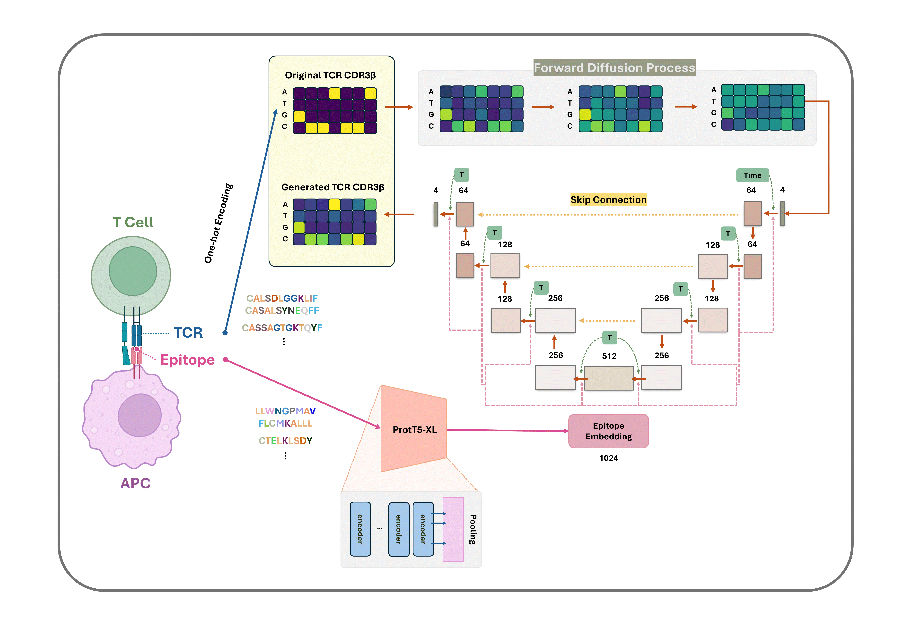

# TCR-epiDiff: Solving Dual Challenges of TCR Generation and Binding Prediction
## Motivation
T-cell receptors (TCRs) are fundamental components of the adaptive immune system, recognizing specific antigens for targeted immune responses. Understanding their sequence patterns for designing effective vaccines and immunotherapies. However, the vast diversity of TCR sequences and complex binding mechanisms pose significant challenges in generating TCRs that are specific to a particular epitope.
## Overview of the TCR-epiDiff architecture. 
</img> 
