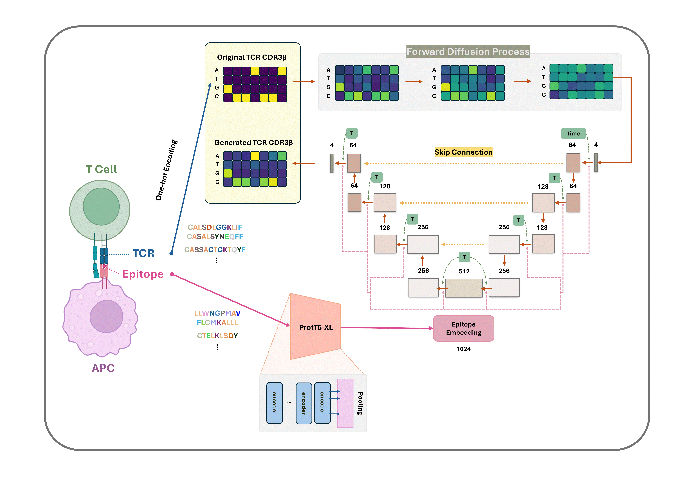
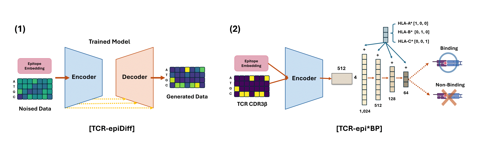

# TCR-epiDiff: Solving Dual Challenges of TCR Generation and Binding Prediction
## Motivation
T-cell receptors (TCRs) are fundamental components of the adaptive immune system, recognizing specific antigens for targeted immune responses. Understanding their sequence patterns for designing effective vaccines and immunotherapies. However, the vast diversity of TCR sequences and complex binding mechanisms pose significant challenges in generating TCRs that are specific to a particular epitope.
## Overview of the TCR-epiDiff architecture 
</img><br/>

* ✅ TCR-epiDiff was inspired by Denoising Diffusion Probabilistic Models(DDPM). The model employs a U-Net architecture that projects the encoded sequences into 512 dimensions. To generate epitope-specific TCRs, we integrated epitope information into each layer of the DDPM. The epitope sequences were embedded using proT5-XL(Pokharel, et al., 2022). These embeddings were incorporated into every layer of the TCR-epiDiff model to ensure the epitope-specificity of the generated TCRs.

## Objective
</img><br/>
* **(1)** The model enables the de novo generation of TCRs specific to target epitopes.
* **(2)** We utilized the TCR-epiDiff encoder to build a classifier for TCR-epitope binding prediction.

## Dependencies
```python
pip install -r requirements.txt
```


## License
TCR-epiDiff and TCR-epi*BP code and data are freely available for academic use in non-commercial research. However, if you intend to use our model or scripts for any commercial application, you must obtain a separate license.
